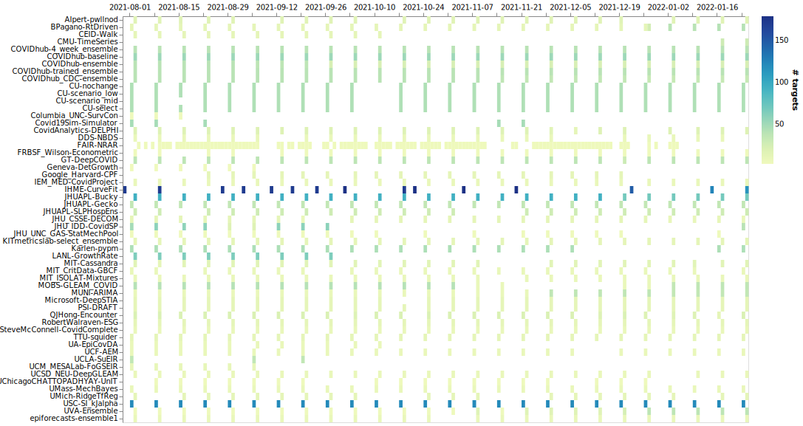
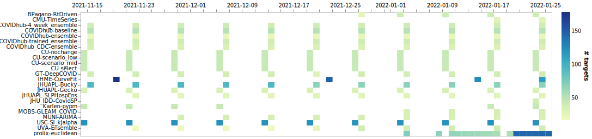
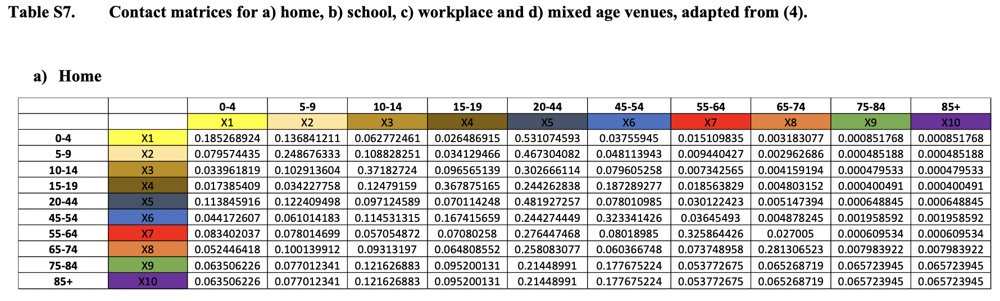

```{r setup, include=FALSE}
library(tidyverse)
library(lubridate)
library(fontawesome)
options(htmltools.dir.version = FALSE)
knitr::opts_chunk$set(
  dev = "svg",
  fig.path = "gfx/",
  fig.align = 'center',
  fig.width=9, fig.height=3.5, fig.retina=3,
  fig.showtext = TRUE,
  out.width = "100%",
  cache = TRUE,
  autodep = TRUE,
  echo = FALSE,
  message = FALSE, 
  warning = FALSE,
  hiline = TRUE
)
```

```{r xaringan-themer, include=FALSE, warning=FALSE}
library(xaringanthemer)
primary = "#002145"
secondary = "#6495ed"
tertiary = "#ffa319"
fourth_color = "#DB0B5B"

style_duo_accent(
  primary_color      = primary,  #"#002145", # UBC primary
  secondary_color    = secondary,  #"6EC4E8", # UBC secondary 4
  header_font_google = google_font("EB Garamond"),
  text_font_google = google_font("Open Sans"),
  code_font_google = google_font("Fira Mono"),
  text_color = primary,
  table_row_even_background_color = lighten_color(primary, 0.8),
  colors = c(
    tertiary = tertiary, fourth_color = fourth_color,
    light_pri = lighten_color(primary, 0.8),
    light_sec = lighten_color(secondary, 0.8),
    light_ter = lighten_color(tertiary, 0.8),
    light_fou = lighten_color(fourth_color, 0.8)
    ),
  outfile = here::here("src/xaringan-themer.css")
)
# theme_set(theme_xaringan())
```

```{r cover, include=FALSE, fig.width=16, fig.height=4}
library(covidcast)
hosp <- covidcast_signal("hhs", "confirmed_admissions_covid_1d_prop", 
                         geo_type = "state", start_day = "2020-11-15") %>%
  select(time_value, value, geo_value)
regions <- state_census %>% select(REGION, ABBR) %>% 
  mutate(geo_value = tolower(ABBR), region = as.factor(REGION)) %>%
  select(geo_value, region)
left_join(hosp, regions) %>%
  ggplot(aes(time_value, value,
             color = region, group = geo_value)) +
  geom_line(size = 1) +
  theme_void() +
  scale_x_continuous(expand = expansion()) +
  scale_y_continuous(expand = expansion()) +
  theme(plot.background = element_rect(fill = primary),
        legend.position = "none") +
  scale_color_brewer(palette = "PRGn", direction = -1)
```


layout: true

<div class="my-footer"><span><a href="https://dajmcdon.github.io/delphi-forecast-landscape" style="color:white">dajmcdon.github.io/delphi-forecast-landscape</a></span></div> 

---
background-image: url("gfx/cover-1.svg")
background-size: contain
background-position: top

<br><br><br><br><br><br><br><br><br><br><br>


.center[# The COVIDhub Forecaster Landscape]


.pull-left[
###Daniel J. McDonald
###University of British Columbia
####Delphi All Hands &mdash; 28 January 2022
]

---

## The Forecasing task


.pull-left-wide[
* Every week, submit forecasts to [COVID-19 **Forecast**Hub](https://covid19forecasthub.org)

* The first forecasts were submitted on 20 July 2020

* Originally "State Deaths"

* Added "County Cases" a bit later, and eventually "Hospitalizations"

* Hub also collects (now) a few other targets
]

.pull-right-narrow[

]


--

### The goal

* Forecasts from many teams are combined into an "ensemble"

* The ensemble generally has the best performance, and is the official [CDC Forecast](https://covid.cdc.gov/covid-data-tracker/#forecasting)

* Some members of ForecastHub and Delphi collaborate on [Ensemble creation](https://forecasters.org/blog/2020/10/28/comparing-ensemble-approaches-for-short-term-probabilistic-covid-19-forecasts-in-the-u-s/)

---

## The Forecasts


* "point" forecasts and "quantiles"

* Predict 1-4 epiweeks ahead (some targets)

* Predict 0-28 days ahead (hospitalizations)

* Some teams produce longer-term forecasts ...


```{r cal-deaths, fig.width = 8, fig.height = 3}
source("src/ca-trajectory.R")
ca_traj
```

---

## The Forecasters

```{r all-teams, fig.height=5}

```

---

## Hospitalization forecasters

```{r hosp-teams, fig.height=3}

```

--

.pull-left[
* BPagano - SIR 
* CMU - Time Series
* Colorado (4 versions) - SEIR, different scenarios
* Georgia Tech - Deep learning...
* IHME (rarely) - SEIR
* Johns Hopkins (3 in Applied Physics) - SEIR, Time series, ensemble
* Johns Hopkins (other, Infection Dynamics) - SEIR
]

.pull-right[
* Dean Karlen (Physicist at UVic) - SEIR type
* MOBS-Gleam - Agent based mobility model
* USC - SEIR
* UVA - Ensemble of VAR, LSTM, SEIR
* Prolix - "Offsets obtained by correlations, best linear approximation of reproduction rates (using vaccination  approximation) by least euclidean distance, and linear prediction."
]

---

## Time series (simplification)

> On day $t$, model hospitalizations at day $t+a$ as a function of today's hospitalizations and those in the recent past.


.secondary[For example:]

$$\widehat{y}_{t+a} = a_{0} y_{t} + a_{7}y_{t-7} + a_{14} y_{t-14} + b_0 x_t + b_{7} x_{t-7}$$

.secondary[COVIDhub Baseline:]

$$\widehat{y}_{t+a} = y_{t}$$

* Seemingly, straightforward to do.
* Performs surprisingly well, most of the time.
* Not so good when you'd most want it to work.
* Uses essentially no information about epidemics.

---
class: middle

## SIR-type (compartmental) models - Stochastic Version

(Borrowed heavily from [Cosma Shalizi](http://www.stat.cmu.edu/~cshalizi/dst/20/lectures/20/lecture-20.html), Ryan Tibshirani, [Dean Karlen](https://pypm.github.io/home/docs/studies/reports/Characterizing_spread.pdf))


.pull-left[
Suppose each of N people in a bucket at time t:

1. .large[.fourth-color[Susceptible(t)]] : not sick, but could get sick
1. .large[.secondary[Infected(t)]] : sick, can make others sick
1. .large[.tertiary[Removed(t)]] : either recovered or dead; not sick, can't get sick, can't make anyone sick


<hr>

**Assume**: During period h, each .fourth-color[S] meets kh people.  
**Assume**: Prob( .fourth-color[S] meets .secondary[I] and becomes .secondary[I] ) = c.  
.fourth-color[So]: Prob( .fourth-color[S] $\rightarrow$ .secondary[I] ) = $1 - (1 - c I(t)  / N )^{hk} \approx kchI(t) / N$  
.fourth-color[So]: New .secondary[I] in time h $\sim Binom(S(t),\ kchI(t) / N)$  
**Assume**: Prob( .secondary[I] $\rightarrow$ .tertiary[R]) = $\gamma h$  
.fourth-color[So]: Sew removals in time h $\sim Binom(I(t),\ \gamma h)$


]

.pull-right[

```{r sir-dag, echo = FALSE, fig.height=4}
sir <- tibble(nodes = c("S", "I", "R"),
              x = c(1, 3, 5),
              y = c(0, 0, 0))
eps = .5
arrows <- tibble(x0 = c(1, 3) + eps, x1 = c(3, 5) - eps, y0 = 0, y1 = 0)
cols <- c("S" = fourth_color, "I" = secondary, "R" = tertiary)

g <- ggplot(sir) +
  geom_point(aes(x, y, color = nodes), shape = 16, size = 25) +
  geom_segment(data = arrows, aes(x=x0, xend=x1, y=y0, yend=y1),
               arrow = arrow(type = "closed")) +
  geom_text(aes(x, y, label = nodes), color = "white", size = 16) +
  theme_void() +
  xlim(c(0,6)) +
  scale_color_manual(values = cols) +
  theme(legend.position = "none")

g
```

]

---
class: middle

.pull-left[

### Over-all equations:

\begin{aligned}
C(t+h) & =  \mathrm{Binom}\left(S(t),\ \frac{\beta}{N} h I(t)\right)\\
D(t+h) & =  \mathrm{Binom}\left(I(t),\ \gamma h\right)\\
S(t+h) & =  S(t) - C(t+h)\\
I(t+h) & =  I(t) + C(t+h) - D(t+h)\\
R(t+h) & =  R(t) + D(t+h)
\end{aligned}

### In the deterministic limit, 

$N\rightarrow\infty,\ h\rightarrow 0$

\begin{aligned}
N &= S(0) + I(0) + R(0)\\
\frac{dS}{dt} & =  -\frac{\beta}{N} S(t)I(t)\\
\frac{dI}{dt} & =  \frac{\beta}{N} I(t)S(t) - \gamma I(t)\\
\frac{dR}{dt} & =  \gamma I(t)
\end{aligned}

**"_the_ SIR model"** is often ambiguous between these

]

.pull-right[
```{r sir-dag-again, fig.height=4,}
g
```

]

---

## Adding complexity


.pull-left[

* Vanilla SIR is not very interesting, not good for forecasting

* Gives intuition for how an epidemic grows, hits a peak, decreases

.secondary[Dean Karlen] [.secondary[pyPM]](https://pypm.github.io/home/)
* Discrete difference version
* Extra compartments for VOCs, Hospitalizations, deaths, ICU, others
* Estimated with Conditional Least Squares
* Includes "Case Injections", estimated and forced changes in $\beta$
* (Really a whole `python` package for creating compartmental models)
* No age structure
* Location specific
    
]

.pull-right[


]

---
## More complexity - Agent Based Models

.secondary[Take it to the extreme:]

 - Mirror the model for different age buckets
 - Different types of activity people might engage in (lock downers, mixers, covid deniers, etc)
 - Perhaps different cities or even suburbs
 - Allow all these to interact with each other
 
--
 
.secondary[This is essentially an Agent Based Model]

* Fix or calibrate a huge pile of parameters
* Simulate how all these agents behave
* Then see what happens

---
class: middle
background-image: url("gfx/abm.png")
background-size: contain
background-position: right


.pull-left[

### Public Health Agency of Canada

* Agent based model schematic

* Used by PHAC for modelling impact to health care delivery in small areas 
    - Remote Northern towns
    - Indigenous communities

* [.secondary[Overview]](https://nccid.ca/phac-agent-based-model-on-covid-19/)




]

---

## How do different kinds do?


* Research project (among other things)

* Use forecasts to cluster the teams. Maybe compare with Metadata.

* Contact Jacob